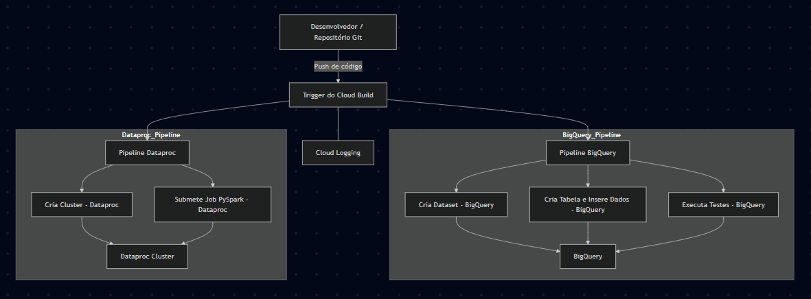

# cloud-build-poc
Este projeto demonstra como utilizar o **Cloud Build** do Google Cloud para implementar um pipeline de integração e entrega contínua (CI/CD). São apresentados workflows que criam e testam recursos no **BigQuery** e que provisionam um cluster no **Dataproc**, possibilitando a automação de testes e o deploy de jobs.

## Visão Geral

O projeto utiliza dois pipelines separados, cada um definido em um arquivo YAML distinto:
- **Pipeline BigQuery**: Cria um dataset e uma tabela de teste, além de executar queries de verificação para validar os dados.
- **Pipeline Dataproc**: Provisiona um cluster e submete um job (por exemplo, um job PySpark) para processamento de dados.

Você pode configurar triggers no Cloud Build para executar automaticamente esses pipelines quando ocorrerem alterações no repositório, ou dispará-los manualmente.



## Requisitos

- Conta no Google Cloud com permissões para Cloud Build, BigQuery e Dataproc.
- [gcloud SDK](https://cloud.google.com/sdk) instalado e configurado.
- Repositório Git contendo os arquivos do projeto.
- Acesso aos repositórios (por exemplo, GitHub ou Cloud Source Repositories) para configurar os triggers de build.

## Estrutura do Projeto
- \ 
- README.md 
- cloudbuild-bigquery.yaml 
- cloudbuild-dataproc.yaml

## Configuração de Triggers
Para automatizar o CI/CD, crie triggers no Cloud Build associando os arquivos de configuração a eventos no seu repositório. Por exemplo:

Trigger BigQuery: Dispara a cada push em uma branch (como main ou dev), executando o pipeline do BigQuery.

Trigger Dataproc: Dispara quando houver alterações específicas ou manualmente, para provisionar o cluster e executar jobs.

Para testar manualmente um trigger, utilize:
```
bash
gcloud beta builds triggers run <trigger-id>
```

Substitua <trigger-id> pelo ID do trigger configurado.

## Fluxo de Trabalho com Git
Utilize um fluxo Git para gerenciar as alterações no código:

## Desenvolvimento:
Realize commits e merges em branches como dev e main.

## Merge de Branches:
Para fazer o merge da branch main na branch dev, execute:

```bash
Copiar
git checkout dev
git pull origin dev
git merge main
git push origin dev
```

## CI/CD Automatizado:
Cada push (ou evento configurado) disparará os pipelines configurados via triggers, validando as alterações e realizando o deploy dos serviços.

```bash
gcloud builds submit --config cloudbuild-dataproc.yaml .
```

Isso garantirá que seu processo de CI/CD esteja automatizado e integrado aos serviços do GCP.

Sinta-se à vontade para ajustar os scripts, adicionar novos passos ou integrar outros serviços do Google Cloud conforme as necessidades do seu projeto.